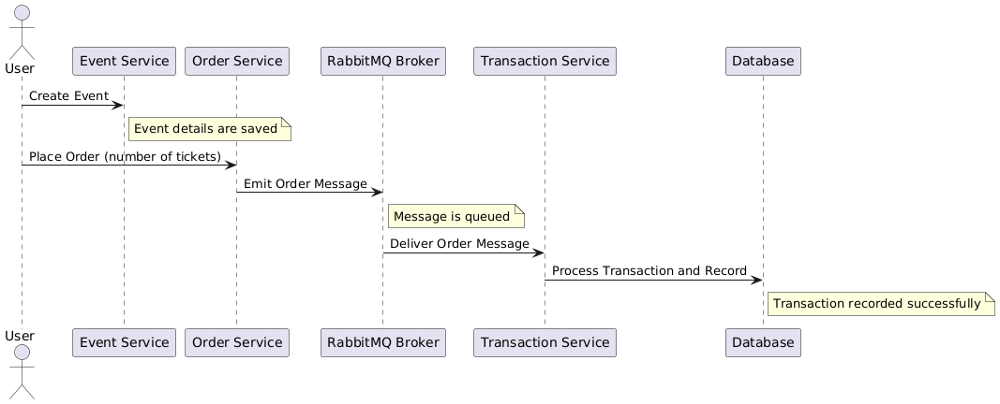

# Asite Event Management Platform

### Overview
The *Asite Event Management Platform* is designed to provide a RESTful API for managing event creation, ticket bookings, and generating analytical data for both events and transactions. The platform has been extended beyond the initial requirements to include an *Orders Service*, which decouples transaction processing from order placement. These services communicate asynchronously via RabbitMQ, enabling scalable transaction processing, particularly in production environments where interactions with third-party payment gateways can introduce delays.

Additionally, for simplicity and ease of deployment, all services have been containerized, exposed through a reverse proxy, and documented with `OpenAPI` specifications. Dummy data can be populated into `MongoDB` using the provided `docker-compose.yml` configuration.

### Architecture
The platform follows a *microservices* architecture that allows independent scaling, development, deployment, and maintenance of services. The workflow is illustrated below:

Workflow Summary

1. *Event Service*: Users can create and manage events.

2. *Order Service*: Handles ticket orders and communicates with the Transaction Service via RabbitMQ.

3. *Transaction Service*: Processes payments asynchronously, ensuring smooth and scalable operations.

4. *Statistic Service*: Provides analytics on events and transactions.

This design allows services to be developed using different languages or frameworks, ensuring flexibility and future-proof scalability.

All services are exposed through a reverse proxy, which simplifies deployment and allows for easy scaling and load balancing. The platform is designed to be deployed on a cloud provider such as AWS, Azure, or Google Cloud, where services can be scaled horizontally to meet demand.

### Requirements
- [**Docker**](https://www.docker.com/) (Ensure Docker is installed and running on your system.)


### Installation
1. Clone the repository.
2. Run `docker-compose up` in the root directory of the project.

#### Documentation for services can be found at:
##### Event Service
`http://localhost/api/events/docs`
##### Order Service
`http://localhost/api/orders/docs`
##### Statistic Service
`http://localhost/api/statistic/docs`
##### Transaction Service
`http://localhost/api/transactions/docs`


### Updating the services package
To rebuild and update a service package:
1. Navigate to the service directory.
```bash
cd ./packages/<service-name>
```
2. Build and push the package.
```bash
docker build -t <package-name> .
docker push <package-name>
```
###### Example: Updating the event service package
```bash
cd ./packages/event-service
docker build -t event-service:latest .
docker push event-service:latest
```

### TODO List
- [ ] Integration tests for the services.
- [ ] Implementing a CI/CD pipeline for the services. Which runs the tests, builds the packages and pushes the packages to a container registry.
- [ ] Redis for caching reduces the load on the database and reduces the time it takes to process requests.
- [ ] Implementing a rate limiter to prevent abuse of the API.
- [ ] Implementing a circuit breaker to prevent cascading failures.
- [ ] Authentication and authorisation for the services.
- [ ] Centralised logging to monitor the health of the services. `Cloudwatch` combined with `Elasticsearch`
- [ ] K8 for orchestration of the services in a production environment. With observability tools such as `Prometheus` and `Grafana`.
- [ ] Migrate to a monorepo tooling such as `pnpm` or `Nx` to manage the services.